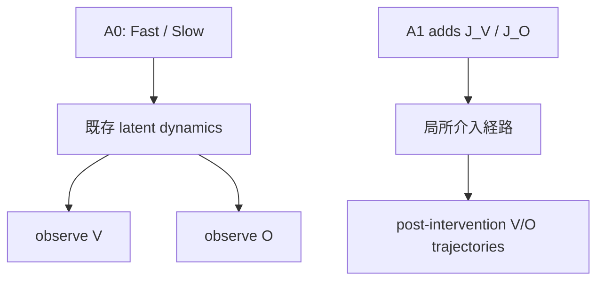
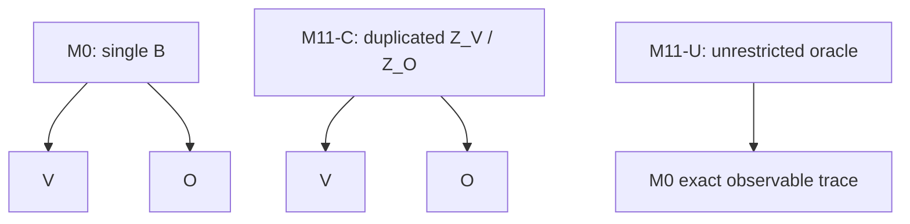

# PH v0.4 Phase 0A Targeted-Access Identifiability Falsification

**Pilot判定：`ACCESS_ASSUMPTION_FAIL`**  
**状態：`PILOT_STOP`**

## 1. Executive Summary

PH v0.3.3-r1で確定した、A0（Fast/Slow外部入力＋V/O観測）下のsingle shared-boundary node identityの構造的 `NON_IDENTIFIABLE` は凍結した。今回のPhase 0Aは、旧35/70D特徴量・旧分類器・旧閾値を変更せず、A1として選択的局所介入 `J_V` / `J_O` を追加した。

しかし、positive controlであるM0自身が、事前登録した双方向cross-effect基準を満たさなかった。M0の `J_V -> O` は `0.019828`、`J_O -> V` は `0.023578`、したがって `Gamma_cross = 0.019828` で、基準 `>= 0.05`を下回った。quality splitの最小target SNRも `0.218`（基準 `>= 2.0`）だった。

よって本結果はPHの支持でも反証でもなく、今回実装したA1 accessが、識別検査に必要なcross-effectの推定可能性を満たさなかったことを示す。Confirmatory/OODは生成していない。

## 2. Frozen Prior Result

- PH v0.3.3-r1のpilot level `INCONCLUSIVE_TECHNICAL / STOP`と、structural identity level `NON_IDENTIFIABLE`を凍結した。
- M0とM11-L3 oracle cloneは全96 seed・6 primary feature、計576値で完全一致した。
- 現行A0のFast/Slow入力とV/O観測だけでは、single shared-boundary node identityは識別できない。
- これはshared causal influence、common cause、PHの自然界での存在、または全alternative classの不存在を意味しない。
- 今回はこの結論を後退させず、旧分類器の再調整も行っていない。

## 3. New Access Model

A0とA1の情報差は、観測変数の追加ではなく、局所介入を新しい操作変数として追加した点にある。

`J_V` / `J_O`は、impulse、finite pulse、PRBS、multisineの4波形、振幅0.5/1.0で実装した。局所区間は時点48–159、内部target-slot labelはseed単位でランダム化し、全modelで同じ写像を使った。analysis codeはmodel identityを使ってtarget labelを補正していない。

データ分割は、index 0–23をaccess selectivity calibration、24–47をqualityおよびM11-C fit、48–95をfrozen Pilot evaluationとした。fresh namespaceは `PH-v0.4-Phase0A` である。

## 4. Model and Adversary Definitions

- **M0**：単一latent boundary state `B`からV/Oが影響を受けるpositive generator。
- **M11-C**：`Z_V` / `Z_O`を別々に持つprimary falsification adversary。local leakage、shared innovation、cross-output couplingの上限を、結果を見る前に固定した。M0 hidden stateは参照せず、M0の観測出力だけでfitした。
- **M11-U**：M0のobservable traceをexact copyするunrestricted oracle canary。M0との同値は予想された結果であり、global identificationの根拠にはしない。
- **M10、M1、M2、M_CD、M_NULL**：legacy mimic、basic negative、common-driver、nullのnegative control群。

M11-Cの固定制約は、calibrationから得た `c_max = 0.081839`、shared innovation上限 `rho_max = 0.25`、cross-output coupling上限 `kappa_max = 0.20`である。

## 5. Independent Calibration

local access selectivityはPH判定を見る前のmodel-independent actuator benchで較正した。cross-talk metricは、

`c = ||direct opposite-side response|| / ||direct target-side response||`

である。calibration結果は以下の通り。

| 指標 | 結果 | 事前基準 | 判定 |
|---|---:|---:|---|
| 最小direct target SNR | 7.640 | >= 5.0 | PASS |
| cross-talk q95 | 0.065471 | margin適用 | PASS |
| 固定 `c_max` | 0.081839 | cap <= 0.20 | PASS |
| actuator calibration | — | finite / dynamic range | PASS |

一方、M0を使ったpre-evaluation quality splitでは、最小target SNR `0.218`、最小cross SNR `0.216`となり、target SNR基準2.0、cross SNR基準1.0を満たさなかった。これはcalibration benchのdirect actuator selectivityと、M0出力上のcross-effect推定可能性が別問題であることを示す。

## 6. Preregistered Metrics

- `N_JV_to_O = D[P(O | do(J_V=a)), P(O | do(J_V=0))]`
- `N_JO_to_V = D[P(V | do(J_O=a)), P(V | do(J_O=0))]`
- `Gamma_cross = min(N_JV_to_O, N_JO_to_V)`
- `D`は固定post-intervention trajectory signatureに対するnormalized energy distance。
- 主要endpointのpositive thresholdは `0.05`、negative upper boundは `0.02`。
- `Delta_ID`は、M0とfit済みM11-Cのzero/JV/JO intervention distributionに対するholdout距離の最大値。equivalence toleranceは `0.02`。

exactまたはtolerance内の構成反例が得られた場合は、classifier repairではなく `NON_IDENTIFIABLE_UNDER_A1` を優先する規則を登録した。

## 7. Gate Results

| Gate | 判定 | 説明 |
|---|---|---|
| G0 Freshness / Provenance | PASS | fresh namespace、target-label独立性、legacy overlap 0 |
| G1 Local Selectivity | PASS | `c_max=0.081839`、direct SNR 7.640 |
| G2 Excitation / SNR | **FAIL** | quality split target SNR 0.218 |
| G3 M0 Bidirectional Cross-Effect | **FAIL** | 両方向とも0.05未満 |
| G4 Basic Negative Specificity | PASS | M1/M2/M_NULLのGammaは0 |
| G5 Legacy Mimic Specificity | PASS | M10のGammaは0 |
| G6 Common Driver Specificity | PASS | M_CDのGammaは0 |
| G7 Constrained Oracle Separation | PASS* | M11-C holdout Delta 0.217192。ただしA1成立前のため支持解釈不可 |
| G8 Profile / Amplitude Robustness | **FAIL** | M0の全cell頑健性未達 |
| G9 Capacity Ladder | PASS | C0–C3を評価、nested boundsを維持 |
| G10 Unrestricted Oracle Firewall | PASS | M11-UのDeltaは0、canaryとして機能 |
| G11 Numerical / Replay Integrity | PASS | finite、deterministic replay、artifact一致 |

G2/G3/G8の失敗により、事前停止規則に従いConfirmatoryへ進まない。

## 8. Oracle Capacity Audit

M11-Cのcapacity ladderは、弱い反例だけを採用していないことを確認するために実行した。

| Capacity | fit objective | holdout Delta_ID |
|---|---:|---:|
| C0 separate / no cross | 0.105335 | 0.395555 |
| C1 measured local leakage | 0.092488 | 0.360037 |
| C2 plus shared innovation | 0.084772 | 0.336583 |
| C3 full constrained M11-C | 0.044199 | 0.217192 |

C3が今回の事前登録範囲で最も強いM11-Cである。M11-C fitはindex 24–47の観測出力のみを使い、evaluation index 48–95の出力やM0 hidden stateを使っていない。M11-Uは別枠のunrestricted canaryで、holdout `Delta_ID = 0`となった。

## 9. Identifiability Analysis

M0のevaluation summaryは、`J_V -> O = 0.019828`、`J_O -> V = 0.023578`、`Gamma_cross = 0.019828`であり、双方向cross-effectの事前基準に達しなかった。したがって、A1が想定するshared-boundary signatureのpositive controlが成立していない。

M11-Cは `J_V -> O = 0.007243`、`J_O -> V = 0.008319`、`Gamma_cross = 0.007243`、holdout `Delta_ID = 0.217192`だった。ただし、これはM0側のaccess/quality Gateが成立しなかった状態で得た条件付きの分離であり、access-conditional identifiabilityの支持には使えない。

結論は、`M11-Cを棄却した`でも`M11-CがM0と同値だった`でもない。今回の実装では、識別を開始する前提となるA1 accessが成立しなかった、という判定である。

## 10. Red-Team Findings

1. **構成反例**：M11-UはM0のobservable traceをexact copyでき、`Delta_ID=0`を再現した。これはunrestricted oracle firewallとして想定内であり、global identificationを禁止する。
2. **未測定交絡**：calibrated channel family外のnonlocal shared actuator pathや共通入力が、見かけのcross-effectを作る可能性は排除していない。
3. **access-model failure**：synthetic actuator benchのselectivityはPASSしたが、M0出力上のcross-effect SNRはFAILした。したがって、今回のA1を物理的な候補境界へのアクセスと解釈してはならない。
4. **恣意的なM11-C制約の懸念**：`c_max`は結果非依存のcalibrationから、`rho_max`/`kappa_max`はpreregistrationから固定した。ただし、これらの上限に外部科学的根拠があることまでは今回示していない。したがって、結果が得られてもconditional claimに限る。
5. **target label漏洩**：seed単位で2通りのslot permutationを同じ規則で全modelに適用し、G0で再現性を確認した。analysisはhidden model identityを参照していない。
6. **capacity増加**：C0→C3でM11-Cのfit objectiveは単調に改善したが、今回のC3はM0をtolerance内には再現しなかった。これはA1成立前の参考情報であり、M11-C以外を棄却しない。

## 11. Claim Firewall

今回許される主張は、指定した合成model familyと実装A1で、M0の双方向cross-effectおよびqualityの事前Gateが成立しなかった、という範囲に限る。

以下は主張しない。

- PHが自然界に存在する／存在しない。
- shared causal influenceやcommon causeが存在しない。
- M11-Cの失敗または成功によって全alternative classを棄却した。
- single latent nodeが人間、自己、意識、クオリア、魂である。
- synthetic resultを生物、人間、脳、意識、AIへ直接一般化する。
- M11-Uに対するglobal identifiabilityが得られた。

## 12. Final Decision

**`ACCESS_ASSUMPTION_FAIL`**

これはPHの存在・不存在の判定ではない。今回のA1 local interventionは、actuator selectivity自体は較正できたが、M0で必要な双方向cross-effectとqualityを満たさず、shared-boundary identityを検査する十分なaccessにならなかった。`PILOT_STOP`としてConfirmatory/OOD生成を禁止する。

## 13. Reproducibility and Artifact Hashes

- Repository / PR：[osskosc-lab/PH #10](https://github.com/osskosc-lab/PH/pull/10)
- Validated experiment/report commit: `a924fabeaae7eed0dc7ab1b3f9e9e3c4bcad5971`
- Experiment code commit: `87e45a2403c77d4daa6ae255f4235ea83be68711`
- GitHub Actions validation run: `33291190334`（workflow success）
- Pilot artifact: `9726013981`
- Pilot artifact ZIP SHA256: `f8f3e045a9bbba4af0232e7f71f3325b539ce269b24c6339dfd4f957514562d6`
- `config.json` SHA256: `e28af7a433f2b22b30f9c660b9b0897c3bae05f77f5a1e0ea867f562887cf782`
- `preregistration.json` SHA256: `53317d9c2bd5f884897e4a72ed329356cb0bf3b4c225be66ebef66d594491a5d`
- Full machine-readable replay comparison: `PASS`
- Required artifact set: `calibration_results.csv`, `intervention_selectivity.csv`, `per_seed_metrics.csv`, `model_summary.csv`, `gate_evidence.json`, `decision.json`, `m11_capacity_ladder.json`, `seed_audit.json`, `replay_audit.json`, `README.md`
- Confirmatory/OOD data: **not generated**

CIのsuccessは実行・再現性・Claim Firewallのsuccessを意味し、科学的なPilot PASSを意味しない。

## 14. Narrowest Defensible Next Step

Phase 0A-r1として、結果を見てthreshold、distance metric、M11-C制約、旧classifierを調整するのではなく、A1 accessの強度・観測SNR・局所介入波形を結果非依存に再設計し、fresh namespaceで再較正する。

M0の双方向cross-effectとquality Gateが成立しない限りConfirmatoryへ進まない。成立した場合も、次はtarget label、介入位置、model identityをblind化したPhase 0B Blind Access Replicationを別途凍結してから評価する。再びM11-Cがequivalence tolerance内に入れば、single-node identification programを停止し、PHをinterventional causal equivalence classとして理論縮約する。
